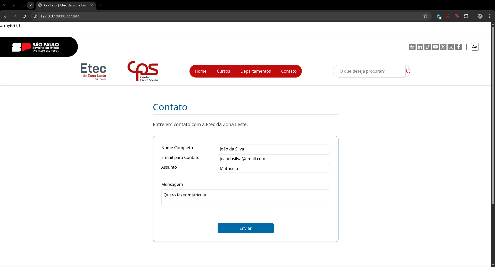

# Laravel - Fallback e Formulário

## Requisitos

- PHP instalado
- Composer instalado
- MySQL instalado e rodando
- Um editor de código VS Code

## Capturas de Tela

### Tela de home

### Exemplo de fallback

### Resultado do fallback

### Código do fallback

### Onde fica o formulário

### var_dump (antes)

### var_dump (código)

### Formulário de contato (código)

### var_dump (depois)

